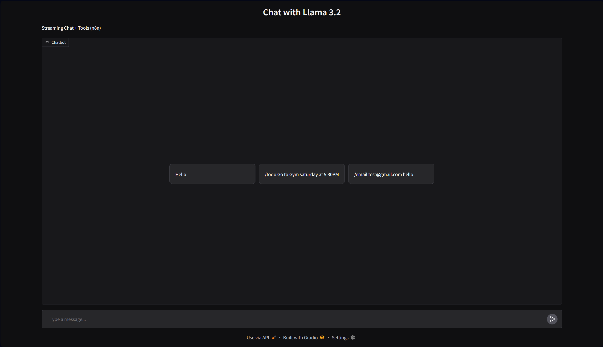
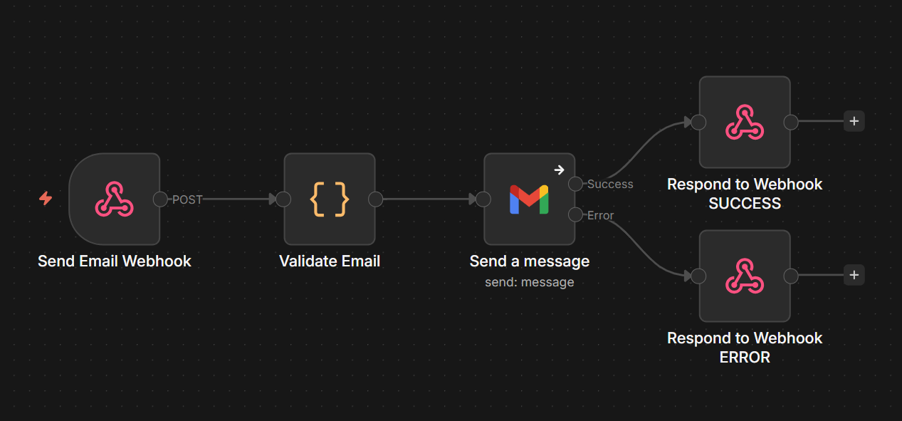
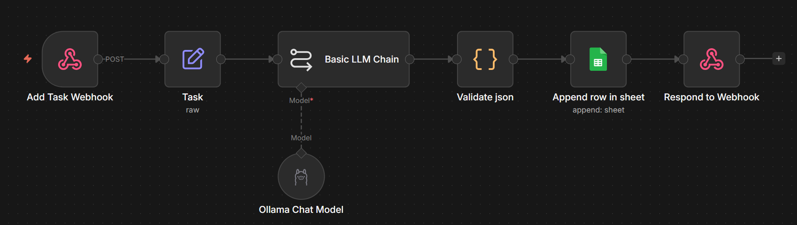

# Llama 3.2 Chat API + Gradio UI + n8n Automations

A lightweight **streaming chat application** built with **FastAPI**, **Gradio**, and **Ollama**, with external tool support through **n8n webhooks** for email and to-do actions.

The project exposes a chat API, a web UI, and special slash commands that let the UI trigger n8n workflows.

---

## Features

- **Streaming chat responses** from an Ollama model.
- **FastAPI backend** with a `/chat` endpoint.
- **Gradio frontend** for a simple chat interface.
- **Slash commands** for tool-based actions:
  - `/email <email> <message>`
  - `/todo <task>`
- **n8n integration** through webhook URLs.
- **Configurable model and timeouts** using environment variables.
- **Pydantic validation** for request and message schemas.
- **uv-friendly project setup**.

---

## Project Overview

This project connects three layers:

1. **UI layer**  
   - Provides a Gradio chat interface.
   - Forwards normal chat messages to the API.
   - Detects special slash commands and calls n8n webhooks.

2. **API layer** 
   - Receives chat messages.
   - Sends them to Ollama.
   - Streams the response back to the client.

3. **n8n layer**  
    - Handle automation tasks like sending emails or creating to-do items.
   - Can be documented visually with a workflow screenshot.

---

## Architecture

### Chat Flow

```text
User message
    ↓
Gradio UI
    ↓
FastAPI /chat
    ↓
Ollama streaming API
    ↓
Streaming response back to UI
```

### Tool Command Flow

```text
User command (/email or /todo)
    ↓
Gradio UI
    ↓
Webhook call to n8n
    ↓
n8n workflow processes the action
    ↓
JSON response returned to the UI
```

---

## How It Works

### Chat Flow

1. The user sends a message from the Gradio interface.
2. The UI formats the conversation history.
3. The UI sends a POST request to the FastAPI `/chat` endpoint.
4. FastAPI validates the payload using Pydantic models.
5. The backend forwards the messages to Ollama using a streaming HTTP request.
6. The streamed chunks are returned to the UI and displayed progressively.

### Tool Flow

1. The user writes a slash command such as:
   - `/email test@gmail.com hello`
   - `/todo Buy groceries`
2. The UI intercepts the command before sending it to the LLM.
3. The UI calls the corresponding n8n webhook.
4. n8n handles the automation and returns a result.
5. The UI shows the result to the user.

---

## Screenshots

### Chat UI



### Email Workflow



### Todo Workflow



---

## Installation

This project is designed to work well with **uv**.

### 1) Clone the repository

```bash
git clone https://github.com/Jaafar-Wannous/llm-chat.git
cd llm-chat
```

### 2) Create or sync the environment with uv

```bash
uv sync
```

If you want to create a fresh virtual environment and install dependencies manually:

```bash
uv venv
uv sync
```

### 3) Configure environment variables

Create the `.env` file and add the required values.

### 4) Start Ollama

Make sure Ollama is running locally and that the model is available:

```bash
ollama pull llama3.2
ollama serve
```

### 5) Run the FastAPI backend

```bash
uv run uvicorn app.main:app --reload
```

### 6) Run the Gradio UI

```bash
uv run python ui/app.py
```

---

## Configuration

The application uses `pydantic-settings` and loads values from a `.env` file.

### `app/config.py`

```python
class Settings(BaseSettings):
    ollama_url: str
    api_url: str
    email_webhook: str
    todo_webhook: str

    default_model: str = "llama3.2"

    connect_timeout: float = 10.0
    read_timeout: float = 180.0
    write_timeout: float = 30.0
    pool_timeout: float = 10.0

    model_config = SettingsConfigDict(
        env_file=".env",
        extra="ignore"
    )
```

### Required environment variables

Create a `.env` file in the project root:

```env
OLLAMA_URL=http://127.0.0.1:11434/api/chat
API_URL=http://127.0.0.1:8000/chat
EMAIL_WEBHOOK=http://127.0.0.1:5678/webhook/email
TODO_WEBHOOK=http://127.0.0.1:5678/webhook/todo
```

---

## API Endpoints

### `GET /health`

Returns the health status of the API.

**Response**

```json
{
  "status": "ok"
}
```

### `POST /chat`

Streams a response from Ollama.

**Request body**

```json
{
  "model": "llama3.2",
  "messages": [
    {
      "role": "user",
      "content": "Hello"
    }
  ]
}
```
**Supported roles**

- `system`
- `user`
- `assistant`

**Response**

The endpoint returns a **streaming plain-text response**.

---

## Slash Commands

### `/email`

Send an email through the configured n8n webhook.

**Usage**

```text
/email test@gmail.com your message here
```

**Example**

```text
/email test@gmail.com Hello, this is an automated message.
```

### `/todo`

Create a to-do item through the configured n8n webhook.

**Usage**

```text
/todo your task here
```

**Example**

```text
/todo Buy milk after work
```

### Unknown commands

Any other command starting with `/` returns:

```text
❌ Unknown command
```

---

### File Responsibilities

#### `app/config.py`
Defines application settings using `pydantic-settings`.

#### `app/schemas.py`
Contains the request and message schemas used by the API.

#### `app/llm.py`
Streams chat completions from Ollama and handles connection/runtime errors.

#### `app/main.py`
FastAPI entry point exposing the `/health` and `/chat` endpoints.

#### `ui/app.py`
Gradio frontend that:
- keeps conversation history
- sends chat messages to the API
- handles `/email` and `/todo` commands
- displays streamed output to the user

---

## Error Handling

The project includes error handling for:

- missing Ollama URL
- HTTP connection failures
- Ollama status errors
- invalid webhook responses
- malformed tool commands
- empty messages

Examples:

- `❌ Usage: /email test@gmail.com your message`
- `❌ Usage: /todo your task`
- `❌ Connection error: ...`

---

## Troubleshooting

### Ollama not responding
- Make sure `ollama serve` is running
- Check OLLAMA_URL

### Webhooks failing
- Verify n8n is running
- Check webhook URLs in `.env`
- Check n8n execution logs for errors

### Empty responses
- Ensure the model is pulled:
  ollama pull llama3.2